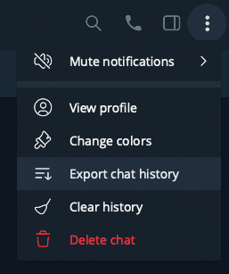
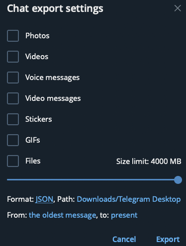

# Chat with your Telegram Chat! 

Understand who you are and your relationships by creating a ChatGPT like experience over your own Telegram chat with [LangChain](https://github.com/hwchase17/langchain). 

Here is a very scientific peer-reviewed mathematical equation:

 ```
 Your Telegram chats ≈ Your thoughts ≈ You
 ```


When have you been the happiest? What triggers you instantly? How could you have been more compassionate? When do you say yes and when do you say no? At what time are you the funniest?


Ask anything you've wanted to know about yourself and your relationship with someone.

## Ingest data
From the Telegram Desktop App, export your chat history.



Uncheck all the boxes and make sure you export it in `JSON`, you will then be able to download a `result.json` file.



You can then embed the data by running 

```python ingest_data.py [result.json path]```


## Running the Application

You can query your embedded data by running `python cli_app.py`.

You can also easily interact with your Telegram Chat through a Gradio Web App, by running `python app.py` from the command line, or by visiting https://huggingface.co/spaces/maxime/chat-with-your-telegram-chat


*The original boilerplate is from https://github.com/hwchase17/chat-your-data*
